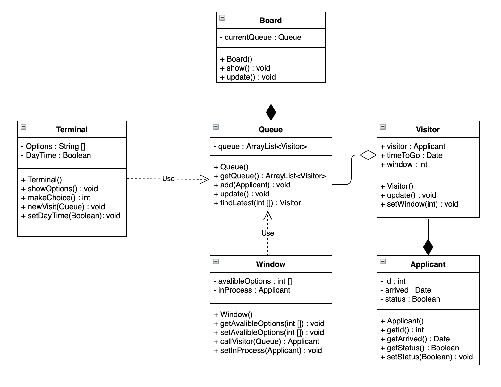

# Визовый центр
## Общая идея 

Визовый центр разрабатывает систему электронных очередей.

Для этого в залах центра устанавливается информационный терминал выдачи талонов и табло с информацией о состоянии очереди, а все рабочие места операционистов ("окна") нумеруются и оснащаются кнопками вызова заявителей.

В информационном терминале заявитель выбирает цель посещения и получает талон с номером в очереди. Центр работает в двух режимах: до обеда принимает заявки на получение визы, после обеда - выдает документы с результатами рассмотрения. В зависимости от текущего режима работы список целей визита в терминале выглядит по-разному.

До обеда (прием заявок):
- краткосрочное пребывание
- долгосрочное пребывание
- пребывание с целью пользования медицинскими услугами
- транзит

После обеда (выдача документов):
- получение документов

Табло показывает текущий статус очереди: список из двух колонок. В первой колонке отображается номер талона, во второй - номер "окна" при наступлении очереди заявителя или его плановое время ожидании в очереди. Плановое время рассчитывается статистически по усредненной скорости движения очереди.

Для "окна" определяется, какие категории заявок (целей визита) могут быть обработаны операционистом. Также оно оснащается кнопкой "Вызвать заявителя". При вызове заявителя среди всех категории "окна" выбирается талон с максимальным на текущий момент временем ожидания и на табло изменяется статус этого талона: во второй колонке появляется номер вызвавшего "окна".

